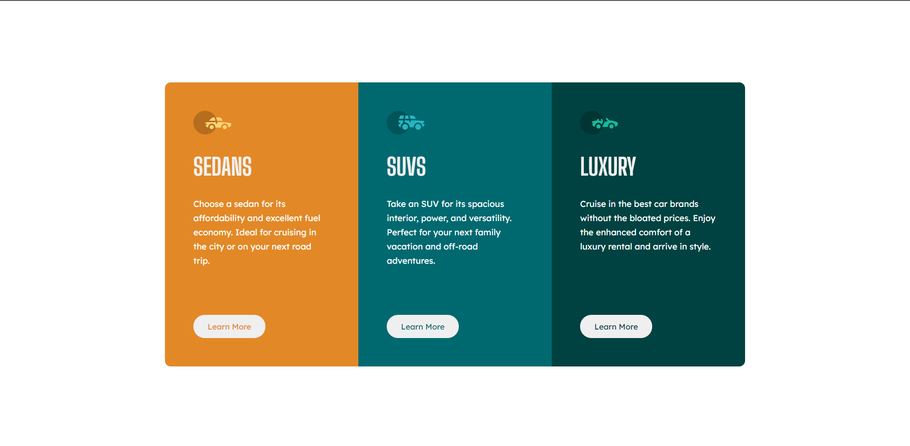

# Frontend-Mentor-3-Column-Layout-Challenge

This is a solution to the [3-column preview card component challenge on Frontend Mentor](https://www.frontendmentor.io/challenges/3column-preview-card-component-pH92eAR2-).
Frontend Mentor challenges help you improve your coding skills by building realistic projects. 

### The challenge

Users should be able to:

- View the optimal layout depending on their device's screen size
- See hover states for interactive elements

### Screenshot

### Links

- Solution URL: [Add solution URL here](https://www.frontendmentor.io/solutions/plain-html-and-css-site-with-flexbox-ZsAnWH88A)
- Live Site URL: [Add live site URL here](https://frontendmentoriochallenge-3-column-layout.netlify.app/)

### Built with

- Semantic HTML5 markup
- CSS custom properties
- Flexbox
